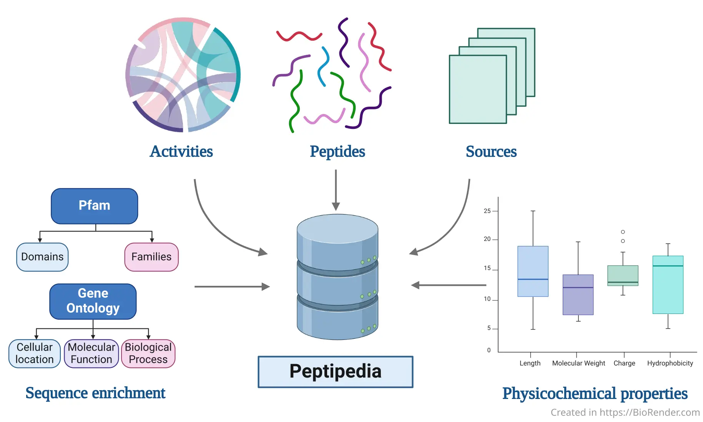

# Peptipedia v2.0



This repository contains the source code for Peptipedia, a peptide sequence database and user-friendly web platform, available at [app.peptipedia.cl](https://app.peptipedia.cl/).

## Summary

In recent years, peptides have gained significant relevance due to their therapeutic properties. The surge in peptide production and synthesis has generated vast amounts of data, enabling the creation of comprehensive databases and information repositories. Advances in sequencing techniques and artificial intelligence have further accelerated the design of tailor-made peptides. However, leveraging these techniques requires versatile and continuously updated storage systems, along with tools that facilitate peptide research and the implementation of machine learning for predictive systems. This work introduces Peptipedia v2.0, one of the most comprehensive public repositories of peptides, supporting biotechnological research by simplifying peptide study and annotation. Peptipedia v2.0 has expanded its collection by over 45% with peptide sequences that have reported biological activities. The functional biological activity tree has been revised and enhanced, incorporating new categories such as cosmetic and dermatological activities, molecular binding, and antiageing properties. Utilizing protein language models and machine learning, more than 90 binary classification models have been trained, validated, and incorporated into Peptipedia v2.0. These models exhibit average sensitivities and specificities of 0.877±0.0530 and 0.873±0.054, respectively, facilitating the annotation of more than 3.6 million peptide sequences with unknown biological activities, also registered in Peptipedia v2.0. Additionally, Peptipedia v2.0 introduces description tools based on structural and ontological properties and user-friendly machine learning tools to facilitate the application of machine learning strategies to study peptide sequences.

## How to cite

If you use Peptipedia in your research, please cite the following article:

> Gabriel Cabas-Mora, Anamaría Daza, Nicole Soto-García, Valentina Garrido, Diego Alvarez, Marcelo Navarrete, Lindybeth Sarmiento-Varón, Julieta H Sepúlveda Yañez, Mehdi D Davari, Frederic Cadet, Álvaro Olivera-Nappa, Roberto Uribe-Paredes, David Medina-Ortiz, Peptipedia v2.0: a peptide sequence database and user-friendly web platform. A major update, Database, Volume 2024, 2024, baae113, https://doi.org/10.1093/database/baae113

```bibtex
@article{cabas2024peptipedia,
  title     = {Peptipedia v2.0: a peptide sequence database and user-friendly web platform. A major update},
  author    = {Cabas-Mora, Gabriel and Daza, Anamar{\'\i}a and Soto-Garc{\'\i}a, Nicole and Garrido, Valentina and Alvarez, Diego and Navarrete, Marcelo and Sarmiento-Var{\'o}n, Lindybeth and Sep{\'u}lveda Ya{\~n}ez, Julieta H and Davari, Mehdi D and Cadet, Frederic and others},
  journal   = {Database},
  volume    = {2024},
  pages     = {baae113},
  year      = {2024},
  publisher = {Oxford University Press UK},
  doi       = {10.1093/database/baae113}
}
```

## Requirements and instalation

This web application was implemented using a client-server architecture. The `frontend` and `backend` directories contain information about requirements and instalation in their own `README.md`.

You can find Peptipedia database in [in this Google Drive link](https://drive.google.com/file/d/1uvTGOdjpsPYxvx00g8KbMv5tTDKsjSAg/view?usp=drive_link).
